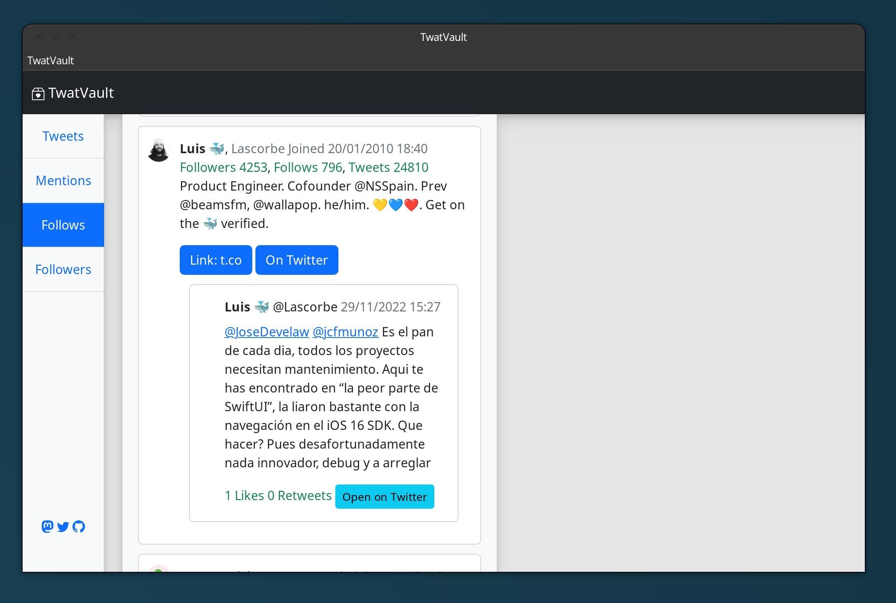

# TwitVault


## Easily Archive and Search Your Twitter Data with our Syncable Desktop App


TwitVault is a cross platform desktop app that uses the Twitter api to download
your profile data. It can also sync your profile to retrieve new data (with some limitations) and
it can import some data from the official Twitter archives. You can then browse and search
your offline Twitter data from the convenience of a native (well, partially native) deskop app.

### Features

- Import Tweets from an existing Twitter archive (see below)
- Archive your tweets.
  - Optionally including respones to your tweets
  - Optionally including tweet media (videos, images)
- Archive your mentions.
  - Optionally including user profiles
  - Optionally including profile images
- Follows and Followers
  - Optionally including user profiles
  - Optionally including profile images
- Your lists (the ones you created)
  - Optionally including member user profiles
  - Optionally including member profile images
- Search within your downloaded data [see screenshot](media/search.jpg)
- See your Tweets reverse chronological beginning with your first Tweets.
- Sync, to download newer Tweets, mentions or responses
- Runs on macOS, Linux and Windows. Can also run in the terminal.

### Limitations

Known Issue: The Windows version curently doesn't display media / images. They're being downloaded though.

There ~might~ will be bugs for various usecases that I haven't run into during my testing.

Due to API limitations, not all data can be archived. For every category, Twitter only returns a certain amount of data:

- No Bookmarks: Bookmarks require using the Twitter API V2. Currently my Twitter API Dashboard is disabled (I applied for access again, but haven't heard back), so I can't create a V2 Key. I already wrote the code to import the bookmarks (well, a raw, unfinished debug version), but then I couldn't test it because my key is incompatible. [The original code is here](https://github.com/terhechte/twitvault/commit/fbb2c334778a8fe7cbf8c0a184582f9447bbdaf5#diff-75b4decd4b27781684dc107fc2f8430b9d92699f8943cceeab16ea2ed3a9b9acL560)
- Your Tweets: max 3.200
- Your Mentions: max 800
- Follows / Followers: No idea, but at least 5000, probably more
- Lists: Max 1000, max 5000 members per list

> Note: I can't change the description of my API Key, so don't be confused that the app describes
> itself as
> **SwiftWatch** when you're authenticating with it.

### Download / Installation

You will need at least Rust 1.65.0 because I've been waiting for [`let else` for a long time](https://rust-lang.github.io/rfcs/3137-let-else.html) (it was the first thing I missed when I started doing Rust in 2018), I want to use it anywhere.

You can find a download in the release section. Or you can compile it yourself as follows:

``` sh
cargo build --release
```

Note that if you're on Linux, some dependencies need to be met. Check out the [deploy.yml](.github/workflows/deploy.yml)

> You will also need a valid Twitter API Key. Which has to be set in your shell environment.

[To get a Twitter API Key, follow their getting started guide](https://developer.twitter.com/en/docs/twitter-api/getting-started/about-twitter-api)

### Twitter Archive Sync

If you already downloaded an existing Twitter Archive, you can use it to fill up any missing Tweets in your TwitVault import.

First, perform a normal TwitVault backup.

Once the backup is done, exit TwitVault, head to the Terminal, and execute the following command:

``` sh
twitvault import -c ~/twitter-archive-folder

# or on macOS
cd /Applications/TwitVault.app/Contents/MacOS/
./TwitVault import -c ~/Path/To/twitter-archive-folder
/Applications/TwitVault.app/Contents/MacOS/TwitVault import -c ~/Path/To/twitter-archive-folder
```

Afterwards, you can start TwitVault again and it will contain the Tweets.

### More Screenshots

Search:


Linux:



Windows:


Terminal:


### Where is my data stored?

The location of your data depends on your operating system:

- Linux: `/home/username/.config/twitvault`
- Windows: `C:\Users\Username\AppData\Roaming\StyleMac\TwitVault\config`
- macOS: `/Users/username/Application Support/com.StyleMac.TwitVault`

Testing these kinds of things under three different operating systems is kinda hard. So there might be bugs.
