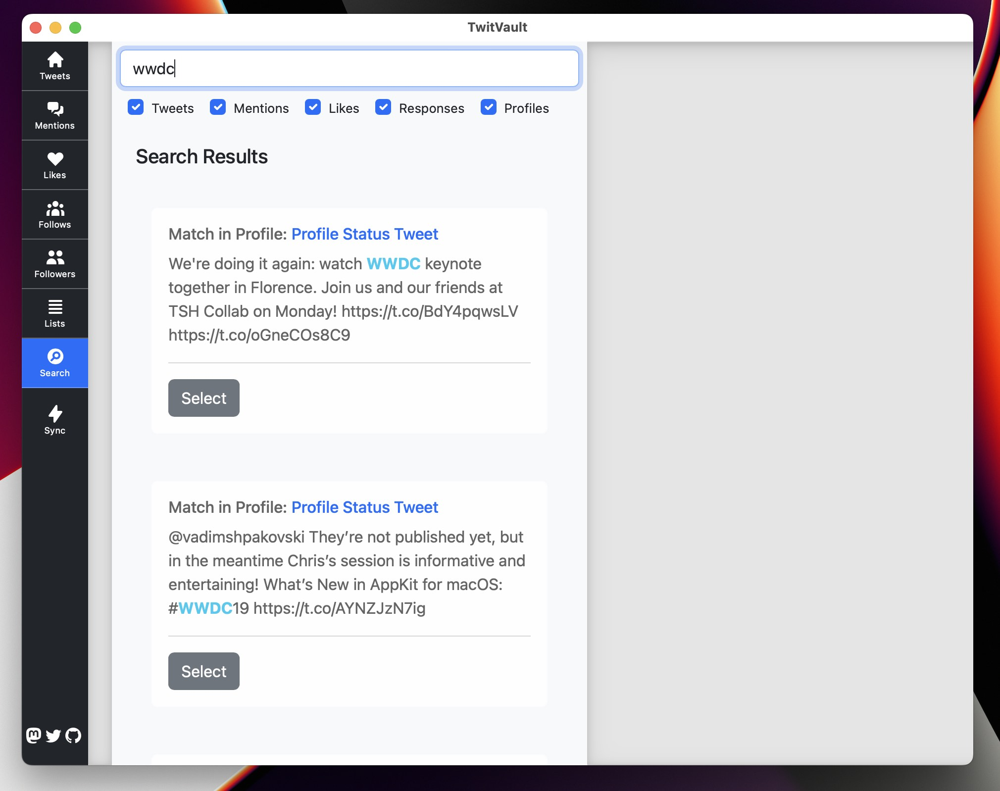
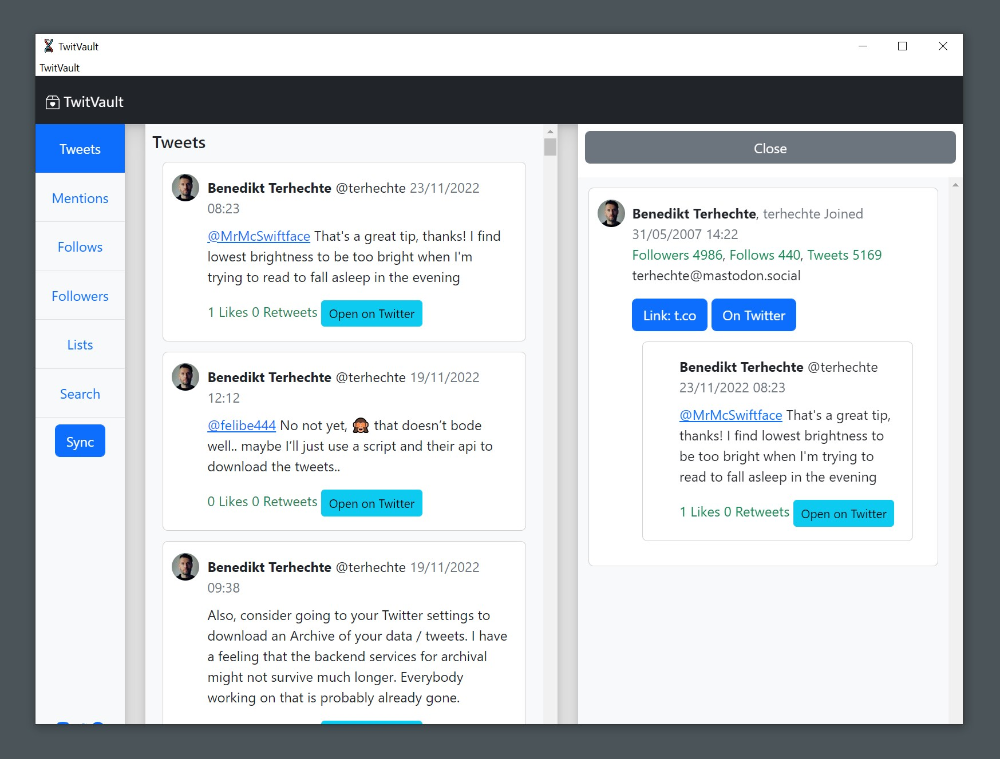
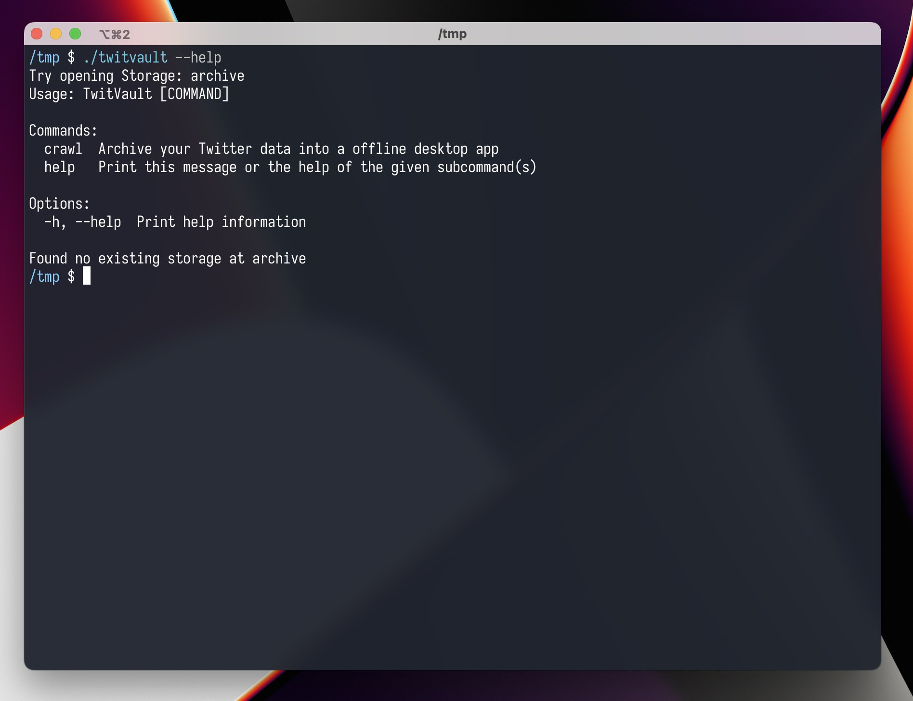

# TwitVault


## Easily Archive and Search Your Twitter Data with our Syncable Desktop App


TwitVault is a cross platform desktop app that uses the Twitter api to download
your profile data. It can also sync your profile to retrieve new data (with some limitations) and
it can import some data from the official Twitter archives. You can then browse and search
your offline Twitter data from the convenience of a native (well, partially native) deskop app.

### Features

- Import Tweets from an existing Twitter archive (see below)
- For any Tweet, also optionally archive the author and the authors profile media
- Archive your tweets.
- Optionally including respones to your tweets
- Archive your mentions.
- Follows and Followers
  - Optionally including user profiles
  - Optionally including profile images
- Your lists (the ones you created) including user profiles / media
- Archive your Liked Tweets
- Search within your downloaded data [see screenshot](media/search.jpg)
- See your Tweets reverse chronological beginning with your first Tweets.
- Sync, to download newer Tweets, mentions or responses
- Delete Tweets on Twitter
- Archive a different users profile / tweets
- Runs on macOS, Linux and Windows. Can also run in the terminal.

### Limitations

There ~might~ will be bugs for various usecases that I haven't run into during my testing.

Due to API limitations, not all data can be archived. For every category, Twitter only returns a certain amount of data:

- No Bookmarks yet. Working on it.
- Your Tweets: max 3.200
- Your Mentions: max 800
- Follows / Followers: No idea, but at least 5000, probably more
- Lists: Max 1000, max 5000 members per list

### Download / Installation

You will need at least Rust 1.65.0 because I've been waiting for [`let else` for a long time](https://rust-lang.github.io/rfcs/3137-let-else.html) (it was the first thing I missed when I started doing Rust in 2018), I want to use it anywhere.

You can find a download in the release section. Or you can compile it yourself as follows (API Keys are explained below)

``` sh
export API_KEY MYAPIKEYasfkaljsf
export API_SECRET MYAPISECRETaslkfdj
cargo build --release
```

Note that if you're on Linux, some dependencies need to be met. Check out the [deploy.yml](.github/workflows/deploy.yml)

> You will also need a valid Twitter API Key. Which has to be set in your shell environment.

[To get a Twitter API Key, follow their getting started guide](https://developer.twitter.com/en/docs/twitter-api/getting-started/about-twitter-api)

### Crawl the data for a different user

You still need to authenticate with your own user account, but you can crawl a different user. This can currently only be
done on the commandline. It also requires the user id of the user you'd like to crawl. Until TwitVault can resolve this, you
can get the user id for any user [via this website](https://tweeterid.com").

Note that on macOS, to run it via the Terminal (if you have it installed in `/Applications/`) you would do `/Applications/TwitVault.app/Contents/MacOS/TwitVault` instead of just `twitvault`.

A custom user should go into a different archive folder. In this example, we will archive the user `@hyperdeck_io` into `~/Documents/hyperdeck_io`:

``` sh
twitvault --custom-archive ~/Documents/hyperdeck_io crawl --custom-user 1263729774540849158
```

Then, follow the instructions in the Terminal.

This will archive the user `hyperdeck` into the `~/Documents/hyperdeck_io` folder.

If you then want to open that archive, you'd do the following:

``` sh
twitvault --custom-archive ~/Documents/hyperdeck_io
```

### Crawl multiple of your accounts

If you have multiple Twitter accounts, you can crawl them via a similar mechanism as above:

``` sh
twitvault --custom-archive ~/Documents/hyperdeck_io
```

This will open the UI and allow you to log in as a different user and then crawl the data. If you, later on, want to
open this or another archive, just use the same command.

### Twitter Archive Sync

If you already downloaded an existing Twitter Archive, you can use it to fill up any missing Tweets in your TwitVault import.

First, perform a normal TwitVault backup.

Once the backup is done, exit TwitVault, head to the Terminal, and execute the following command:

``` sh
twitvault import -c ~/twitter-archive-folder

# or on macOS
cd /Applications/TwitVault.app/Contents/MacOS/
./TwitVault import -c ~/Path/To/twitter-archive-folder
/Applications/TwitVault.app/Contents/MacOS/TwitVault import -c ~/Path/To/twitter-archive-folder
```

Afterwards, you can start TwitVault again and it will contain the Tweets.

### Deleting Tweets

TwitVault allows you to delete Tweets if they're your own. Due to the simplicity of the app, you'll not get any feedback whether
the operation worked or not. Only when you start the app via the Terminal will you see a warning if it didn't work.

### More Screenshots

Search:



Linux (slightly outdated):


Windows (slightly outdated):



Terminal:



### Where is my data stored?

The location of your data depends on your operating system:

- Linux: `/home/username/.config/twitvault`
- Windows: `C:\Users\Username\AppData\Roaming\StyleMac\TwitVault\config`
- macOS: `/Users/username/Application Support/com.StyleMac.TwitVault`

Testing these kinds of things under three different operating systems is kinda hard. So there might be bugs.
